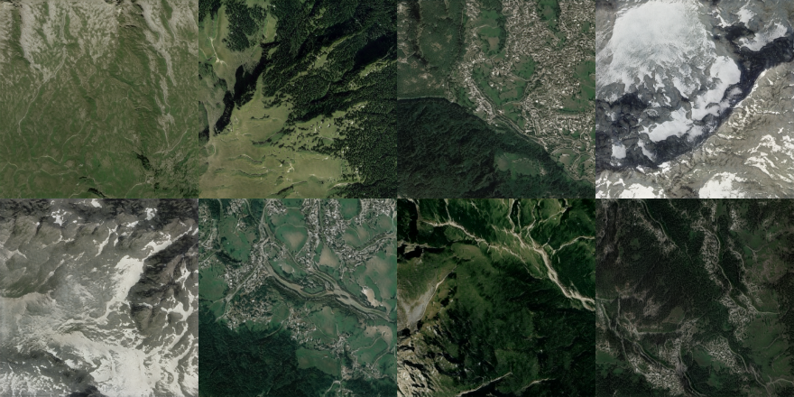
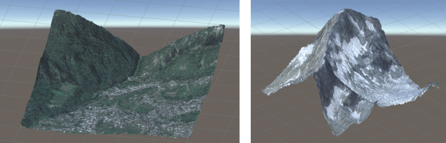

# Landscape_GAN
Final year project for BSc Computer Science at the University of Liverpool.

> This project uses the following resources to generate the terrain data:
> - The specific variant on StyleGAN2, implemented as a [colab notebook](https://github.com/eps696/stylegan2ada/blob/master/StyleGAN2a_colab.ipynb) from [this repository](https://github.com/eps696/stylegan2ada)
> - NVIDIA [StyleGAN2 pytorch architecture](https://github.com/NVlabs/stylegan2-ada-pytorch)
> - Google [Maps Static](https://developers.google.com/maps/documentation/maps-static/overview) and [Elevation](https://developers.google.com/maps/documentation/elevation/start) APIs for dataset creation

**Picture:** *These are not real satellite images. They were generated using the methods discussed in this project.*

This repository contains my final year undergraduate dissertation and the code used to generate the results.

> **Generative Adversarial Networks for Terrain Generation** 
> The full dissertation can be viewed [here](https://drive.google.com/file/d/16sgsRHorQmk6zuQylsT1Qiitose17SVA/view?usp=sharing)
>
> **Abstract:** *For decades, procedural terrain generation methods have been based on fractal and noise based techniques. This work proposes that GANs, specifically the StyleGAN architecture, are a suitable alternative method of terrain generation. Multiple datasets are created and used to train a StyleGAN2 model. The results are then displayed as 3D terrains and compared against traditional techniques.*

**Picture:** *Terrains modelled in Unity from the data generated by StyleGAN2.*

## Results not shown in the dissertation

#### Training on 2,500 128x128 RGBA satellite images over 1,200 epochs (animated gif).
Combined RGBA images (set to a white background)

RGB images (above images seperated to just the first three channels)

Heightmap channel (final channel of original image)

#### Traversal through the latent space of the same dataset
The following gifs show the data generated when travelling between points in the latent space. These were generated from the 512x512 RGBA dataset and the results split into the RGB and height map channels.

